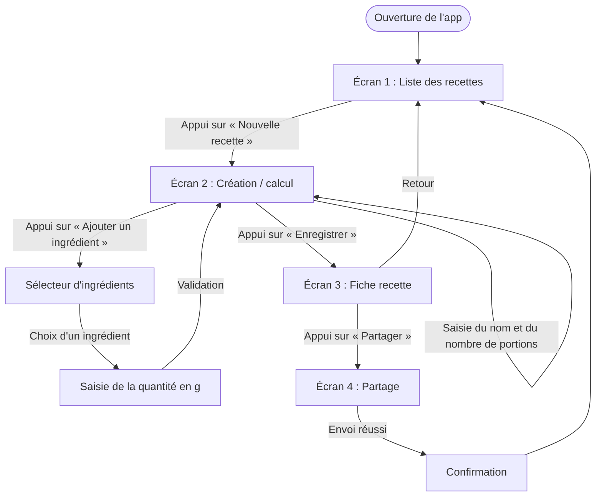

# User Flow — Créer une recette et partager la fiche

**Persona :** Lucas, 25 ans (voir `persona.md`)
**Tâche n°1 :** créer une recette, voir les calories totales et par portion, puis partager la fiche.
**Point de départ :** l'application est ouverte sur la liste des recettes.
**Point d'arrivée :** la fiche est partagée et Lucas revient à la liste.

## Schéma

## Détail pas à pas

| # | Action de l'utilisateur | Écran traversé | Feedback attendu |
|---|---|---|---|
| 1 | Ouvre l'application | Liste des recettes | La liste s'affiche avec les recettes déjà créées (nom, calories par portion). Si elle est vide, un message invite à créer une première recette. |
| 2 | Appuie sur « Nouvelle recette » | Création / calcul | Formulaire vide ; les totaux affichent 0 kcal. |
| 3 | Saisit le nom de la recette (« Tarte au sucre ») | Création / calcul | Le nom apparaît dans le champ ; pas d'erreur. |
| 4 | Indique le nombre de portions (8) | Création / calcul | Le nombre est enregistré ; « Par portion » se met à jour dès qu'il y a des ingrédients. |
| 5 | Appuie sur « Ajouter un ingrédient » | Sélecteur d'ingrédients | Liste fixe d'ingrédients avec leurs kcal pour 100 g ; un champ de recherche filtre la liste. |
| 6 | Choisit un ingrédient (farine) | Saisie de la quantité | Le nom et les kcal pour 100 g sont rappelés ; le clavier numérique s'ouvre. |
| 7 | Saisit la quantité en grammes (250) et valide | Création / calcul | L'ingrédient s'ajoute à la liste avec sa quantité et ses kcal ; **Total du plat** et **Par portion** se recalculent immédiatement. |
| 8 | Répète les étapes 5 à 7 (beurre, sucre, crème) | Création / calcul | Les totaux augmentent à chaque ajout. |
| 9 | (Facultatif) Corrige ou supprime un ingrédient | Création / calcul | La ligne est modifiée ou retirée et les totaux se recalculent. |
| 10 | Appuie sur « Enregistrer » | Fiche recette | La recette est sauvegardée ; la fiche affiche le nom, les ingrédients, le total et les calories par portion. |
| 11 | Appuie sur « Partager » | Partage | Le menu de partage s'ouvre avec un aperçu de la fiche. |
| 12 | Choisit un moyen d'envoi | Partage → Confirmation | Message « Fiche partagée » ; retour possible à la liste. |
| 13 | Revient à la liste | Liste des recettes | La nouvelle recette apparaît en tête de liste. |

## Règles de calcul affichées à l'écran

- **Calories d'un ingrédient** = quantité (g) ÷ 100 × kcal pour 100 g
- **Total du plat** = somme des calories de tous les ingrédients
- **Par portion** = total du plat ÷ nombre de portions (arrondi à l'entier)

## Cas limites à prévoir

Ces cas limites sont repris dans les critères de réussite du `brief.md`.

| Situation | Comportement attendu |
|---|---|
| Aucun ingrédient ajouté | « Enregistrer » est désactivé ; message « Ajoute au moins un ingrédient » |
| Nombre de portions vide ou égal à 0 | Message d'erreur sous le champ ; « Par portion » reste vide |
| Quantité vide ou égale à 0 | La validation est refusée avec un message |
| Recherche d'ingrédient sans résultat | Message « Aucun ingrédient trouvé » |
| Même ingrédient ajouté deux fois | Les deux lignes sont conservées et additionnées |
| Annulation de la création | Retour à la liste sans enregistrer |
